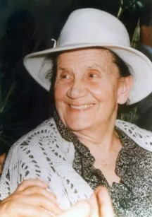

<html>
<body>
    <head>
     <title>Desanka Maksimovic</title>
<link rel="icon" href="ikona.jpg">

  </head>
  
  <h1>Desanka Maksimović</h1>
  <h3><b>Čežnja</b></h3>
  
<i>Sanjam da ćeš doći:
 jer mirišu noći, a drveće lista,
 i novo se cveće svakog jutra rodi;
 jer osmesi ljupki igraju po vodi,
 i proletnjim nebom što od sreće blista;
 
 Jer pupe topole, i kao da hoće
 k nebu, pune tople, nabujale žudi;
 jer u duši bilja ljubav već se budi,
 i mirisnim snegom osulo se voće;
 
 Jer zbog tebe čežnje u vazduhu plove;
 svu prirodu Gospod za tvoj doček kiti.
 Cveće, vode, magle, jablanovi viti,
 sve okolo mene čeka te i zove.
 
 Dođi! Snovi moji u gustome roju
 tebi lete. Dođi, bez tebe se pati!
 Dođi! Sve kraj mene osmeh će ti dati
 i u svemu čežnju opazićeš moju.</i>

 

<b>Biografija</b>

    Desanka Maksimović jedna je od najpoznatijih srpskih pesnikinja. Rođena je kod Valjeva 1898. godine, u porodici učitelja. 
    Vrlo brzo nakon rođenja, s porodicom se preselila u Brankovinu, gde je provela detinjstvo.
     Tamo je polazila osnovnu školu, dok je u gimnaziju išla u Valjevo. 
     Nakon gimnazije, studirala je na Filozofskom fakultetu u Beogradu i to svetsku književnost, istoriju umetnosti i opštu istoriju.
Čim je diplomirala, zaposlila se u gimnaziji u Obrenovcu, a zatim je postala suplent u beogradskoj Trećoj gimnaziji.
 Ubrzo je dobila stipendiju francuske vlade i otišla na usavršavanje u Pariz. Radila je i u Dubrovniku, u učiteljskoj školi,
  a onda se vratila u Beograd, zaposlivši se u Prvoj ženskoj realnoj gimnaziji. 1933. godine ulada se za Sergeja Slastikova,
ali nikada nisu imali dece. Već je na početku Drugog svetskog rata otišla u penziju, ali se 1944. godine vratila na posao i radila još devet godina.
Prve pesme Desanka je počela da objavljuje u časopisu Misao, još 1920. godine. Prvu zbirku pesama objavila je 1924. godine pod nazivom "Pesme".
Za života je objavila preko 50 knjiga. Među njima su zbirke pesama, proza za decu i mlade, zbirke pripovedaka, putopisi i romani. 
 Bavila se i prevođenjem poezije s ruskog, francuskog, slovenačkog i bugarskog jezika.
Ipak, najpoznatija je ostala po svojim pesmama. One su uglavnom bile ili ljubavne ili rodoljubne pesme. 
Jedna od najpoznatijih rodoljubnih pesmama joj je "Krvava bajka", u kojoj je pevala o pokolju đaka u Kragujevcu na početku Drugog svetskog rata. 
Pesma je napisana tokom rata, ali je objavljena tek nakon njega. Ta pesma dio je njene zbirke "Spomen na ustanak", jedne od dvije zbirke rodoljubnih pesama.
 Druga takva zbirka zove se "Srbija se budi".
Za života je Desanka prijateljevala s mnogim značajnim pesnicima i književnicima, primerice s Ivom Andrićem, Milošem Crnjanskim, Isidorom Sekulić, Brankom Ćopićem i Gustavom Krklecom. Bila je član Srpske akademije nauka i umetnosti.
Za svoj književni rad dobila je mnogo priznanja i nagrada. Među njima su Vukova i Njegoševa nagrada, nagrada AVNOJ-a i Zmajeva nagrada te Zlatni venac za životni rad. Desanka Maksimović je počasni građanin grada Valjeva, gdje joj je 1990., još za života, podignut spomenik. Također, osnovna škola koju je Desanka pohađala u Brankovini, 1985. je renovisana i preimenovana u "Desankinu školu".

</body>
</html>
